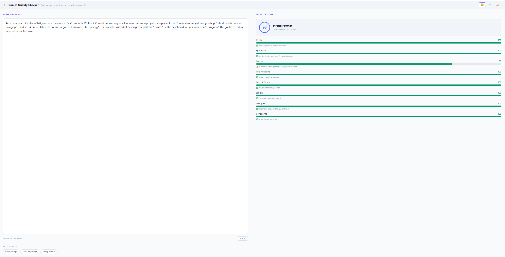
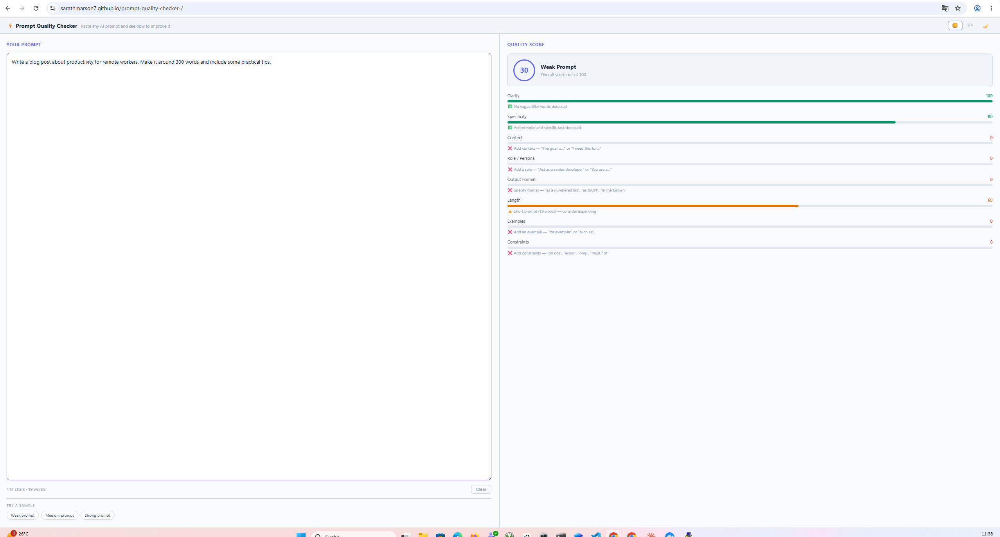

# ⚡ Prompt Quality Checker

A fully static React + Vite web app that analyses any AI prompt and scores it across 8 quality criteria in real time. No backend, no API key, no server — pure client-side JavaScript. Deploys to GitHub Pages.

**Live demo:** [sarathmarson7.github.io/prompt-quality-checker-](https://sarathmarson7.github.io/prompt-quality-checker-/)

---

## Screenshots

### Strong Prompt — 98 / 100



### Medium Prompt — 30 / 100



---

## What It Does

Paste any AI prompt into the left panel. The scorer analyses it instantly (debounced 500 ms) and shows:

- **Overall score** (0–100) with a label: *Strong Prompt / Good Prompt / Needs Improvement / Weak Prompt*
- **8 individual criterion bars** with colour-coded scores and actionable tips
- **3 sample prompts** (Weak / Medium / Strong) to demonstrate the range
- **3 themes** — Light ☀️, Grey 🌥, Dark 🌙 — persisted via `localStorage`

---

## Scoring Criteria

| Criterion | What is checked |
|---|---|
| **Clarity** | Penalises vague filler words: *something, maybe, kind of, a bit, sort of, stuff, things, whatever* |
| **Specificity** | Rewards action verbs (*write, list, summarise, generate, extract*) and measurable targets |
| **Context** | Detects background phrases: *the goal is, because, for a, I need this for, in order to* |
| **Role / Persona** | Detects *"act as", "you are a", "as a [role]", "pretend you are"* |
| **Output Format** | Detects format keywords: *list, table, JSON, bullet, paragraph, step-by-step, markdown, numbered* |
| **Length** | Penalises <10 words (too vague) and >500 words (too cluttered); sweet spot 20–150 words = 100 |
| **Examples** | Detects *"for example", "such as", "e.g.", "for instance", "here is an example"* |
| **Constraints** | Detects *"do not", "avoid", "only", "must not", "never", "don't", "exclude", "without"* |

**Score colours:** 🟢 80–100 · 🟡 50–79 · 🔴 0–49

---

## Project Structure

```
prompt-quality-checker/
├── client/
│   ├── index.html                  # HTML entry point
│   └── src/
│       ├── main.jsx                # React bootstrap
│       ├── App.jsx                 # Root: theme state, debounced scoring, layout
│       ├── App.css                 # CSS custom properties — light/grey/dark themes
│       ├── scorer.js               # Pure scoring engine — 8 criteria functions
│       ├── scorer.test.js          # Node built-in test runner — 23 tests
│       └── components/
│           ├── PromptInput.jsx     # Left panel: textarea, char/word count, sample pills
│           ├── ScorePanel.jsx      # Right panel: score ring, 8 criterion bars + tips
│           └── ThemeToggle.jsx     # ☀️/🌥/🌙 theme toggle
├── docs/
│   └── screenshots/
│       ├── strong-prompt.png
│       └── medium-prompt.png
├── .github/
│   └── workflows/
│       ├── ci.yml                  # Test + build on every push / PR
│       └── release.yml             # Deploy to GitHub Pages on v*.*.* tag
├── vite.config.js                  # root: 'client', base path for GitHub Pages
├── package.json
└── package-lock.json
```

---

## Getting Started

### Prerequisites

- Node.js 18 or later
- npm 9 or later

### 1. Clone the repository

```bash
git clone https://github.com/SarathMarson7/prompt-quality-checker-.git
cd prompt-quality-checker-
```

### 2. Install dependencies

```bash
npm install
```

### 3. Start the development server

```bash
npm run dev
```

Opens at `http://localhost:5173/` with hot module reloading.

### 4. Run tests

```bash
npm test
```

Runs 23 unit tests against the scoring engine using Node's built-in `node:test` runner. No external test framework needed.

### 5. Build for production

```bash
npm run build
```

Outputs to `client/dist/`. The build sets the correct base path (`/prompt-quality-checker-/`) for GitHub Pages automatically.

---

## CI / CD

| Workflow | Trigger | Steps |
|---|---|---|
| `ci.yml` | Every push and PR | `npm ci` → `npm test` → `npm run build` |
| `release.yml` | Tag `v*.*.*` | `npm ci` → `npm run build` → deploy `client/dist/` to GitHub Pages |

### Deploy a new version

```bash
git tag v1.x.x
git push origin v1.x.x
```

The Release workflow builds and deploys automatically. Live within ~30 seconds.

---

## Tech Stack

| Tool | Purpose |
|---|---|
| React 18 | UI components |
| Vite 5 | Dev server and production bundler |
| Node `node:test` | Unit test runner (zero dependencies) |
| CSS Custom Properties | Light / Grey / Dark theming |
| GitHub Actions | CI and release automation |
| GitHub Pages | Static hosting |

---

## Architecture

The scoring engine (`scorer.js`) is a **pure function** — same input always produces the same output, with no side effects or external dependencies. Each of the 8 criteria is an independent scoring function using regex pattern matching and heuristics.

`App.jsx` holds all state: the prompt text, the current theme, and the debounced score result. The two panels (`PromptInput`, `ScorePanel`) are purely presentational — they receive data via props and emit changes via callbacks.

CSS custom properties on the root `div[data-theme]` element drive all three themes. Switching themes updates a single attribute; all colours cascade automatically via `var()` references.
